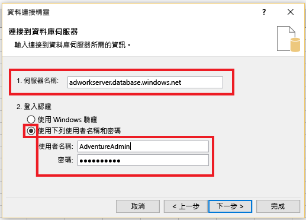
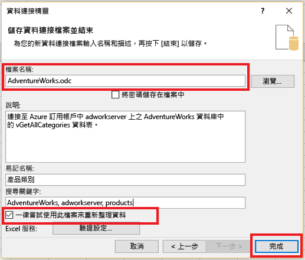
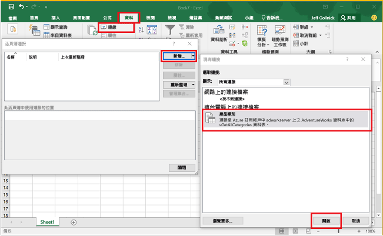

<properties
	pageTitle="將 Excel 連接到 SQL Database | Microsoft Azure"
	description="了解如何將 Microsoft Excel 連接到雲端的 Azure SQL Database。將資料匯入 Excel 中進行報告和資料探索。"
	services="sql-database"
	keywords="連接到 sql, 將資料匯入 Excel"
	documentationCenter=""
	authors="joseidz"
	manager="jhubbard"
	editor=""/>

<tags
	ms.service="sql-database"
	ms.workload="data-management"
	ms.tgt_pltfrm="na"
	ms.devlang="na"
	ms.topic="get-started-article"
	ms.date="07/05/2016"
	ms.author="joseidz"/>

# SQL Database 教學課程：將 Excel 連接到 Azure SQL Database 並建立報告

> [AZURE.SELECTOR]
- [Visual Studio](sql-database-connect-query.md)
- [SSMS](sql-database-connect-query-ssms.md)
- [Excel](sql-database-connect-excel.md)

了解如何將 Excel 連接到雲端的 SQL Database，以便匯入資料並根據資料庫中的值來建立資料表和圖表。在本教學課程中，您將設定 Excel 與資料庫資料表之間的連接、儲存可存放 Excel 資料和連接資訊的檔案，然後根據資料庫值建立樞紐分析圖。

開始之前，Azure 中需要有 SQL Database。如果您沒有，請參閱[建立您的第一個 SQL Database](sql-database-get-started.md) 以取得包含範例資料的資料庫，並執行幾分鐘的時間。在本文中，您會將該文章中的範例資料匯入 Excel 中，但是您可以依照類似的步驟並使用您自己的資料來執行。

您也會需要 Excel。本文使用 [Microsoft Excel 2016](https://products.office.com/en-US/)。

## 將 Excel 連接到 SQL Database 並建立 odc 檔案

1.	若要將 Excel 連接到 SQL Database，請開啟 Excel，然後建立新的活頁簿或開啟現有的 Excel 活頁簿。

2.	在頁面頂端的功能表列中，依序按一下 [資料]、[從其他來源]，然後按一下 [從 SQL Server]。

	

	資料連線精靈隨即開啟。

3.	在 [連接到資料庫伺服器] 對話方塊中，以 <servername>**.database.windows.net** 格式，輸入您要連接的 SQL Database **伺服器名稱**。路如，**adworkserver.database.windows.net**。

4.	在 [登入認證] 之下，按一下 [使用下列的使用者名稱和密碼]，輸入您在建立 SQL Database 時為它建立的 [使用者名稱] 和 [密碼]，然後按 [下一步]。

    

	> [AZURE.TIP] 根據您的網路環境，您可能無法連接，而如果 SQL Database 伺服器不允許來自您的用戶端 IP 位址的流量，您可能會失去連接。移至 [Azure 入口網站](https://portal.azure.com/)，按一下 SQL Server，按一下您的伺服器中，按一下設定下的防火牆並新增您的用戶端 IP 位址。如需詳細資訊，請參閱[如何設定防火牆設定](sql-database-configure-firewall-settings.md)。

5. 在 [選取資料庫和資料表] 對話方塊中，從清單中選取您要使用的資料庫，然後按一下您要使用的資料表或檢視 (我們選擇 **vGetAllCategories**)，然後按 [下一步]。

	

    [儲存資料連接檔案並完成] 對話方塊隨即開啟，請在其中提供 Excel 使用的 Office 資料庫連接 (*.odc) 檔案的相關資訊。您可以保留預設值，或自訂您的選取項目。

6. 您可以保留預設值，但請特別注意 [檔案名稱]。[描述]、[易記名稱] 和 [搜尋關鍵字] 可幫助您和其他使用者記住您要連接的項目並尋找連接。如果您希望連接資訊儲存在 odc 檔案中，以便在連接時進行更新，請按一下 [永遠嘗試使用此檔案來重新整理資料]，然後按一下 [完成]。

    

    [匯入資料] 對話方塊隨即出現。

## 將資料匯入 Excel 中並建立樞紐分析圖
您現已建立連接並建立含有資料與連接資訊的檔案，您可準備開始匯入資料。

1. 在 [匯入資料] 對話方塊中，按一下您要在工作表中呈現資料的選項，然後按一下 [確定]。我們選擇 [樞紐分析圖]。您也可以選擇建立**新工作表**或**將此資料加入至資料模型**。如需資料模型的詳細資訊，請參閱[在 Excel 中建立資料模型](https://support.office.com/article/Create-a-Data-Model-in-Excel-87E7A54C-87DC-488E-9410-5C75DBCB0F7B)。按一下 [屬性] 以瀏覽您在上一個步驟中建立的 odc 檔案的相關資訊，並選擇用於重新整理資料的選項。

	

    工作表現在有空白的樞紐分析表和圖表。

8. 在 [樞紐分析表欄位] 之下，選取所有您要檢視的欄位的核取方塊。

	

> [AZURE.TIP] 如果您要將其他 Excel 活頁簿和工作表連接到資料庫，請按一下 [資料]，按一下 [連接]，按一下 [新增]，從清單中選擇您所建立的連接，然後按一下 [開啟]。

## 後續步驟

- 了解如何[使用 SQL Server Management Studio 連接到 SQL Database](sql-database-connect-query-ssms.md)，以便進行進階查詢和分析。
- 了解[彈性集區](sql-database-elastic-pool.md)的優點。
- 了解如何[建立 Web 應用程式以連接到後端的 SQL Database](../app-service-web/web-sites-dotnet-deploy-aspnet-mvc-app-membership-oauth-sql-database.md)。

<!---HONumber=AcomDC_0706_2016--->