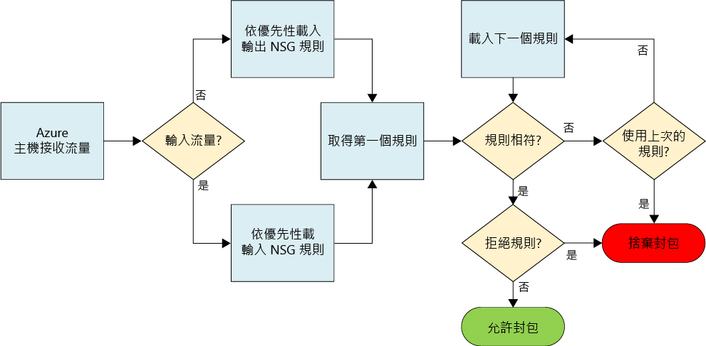
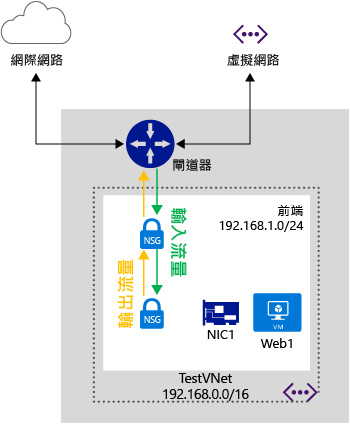
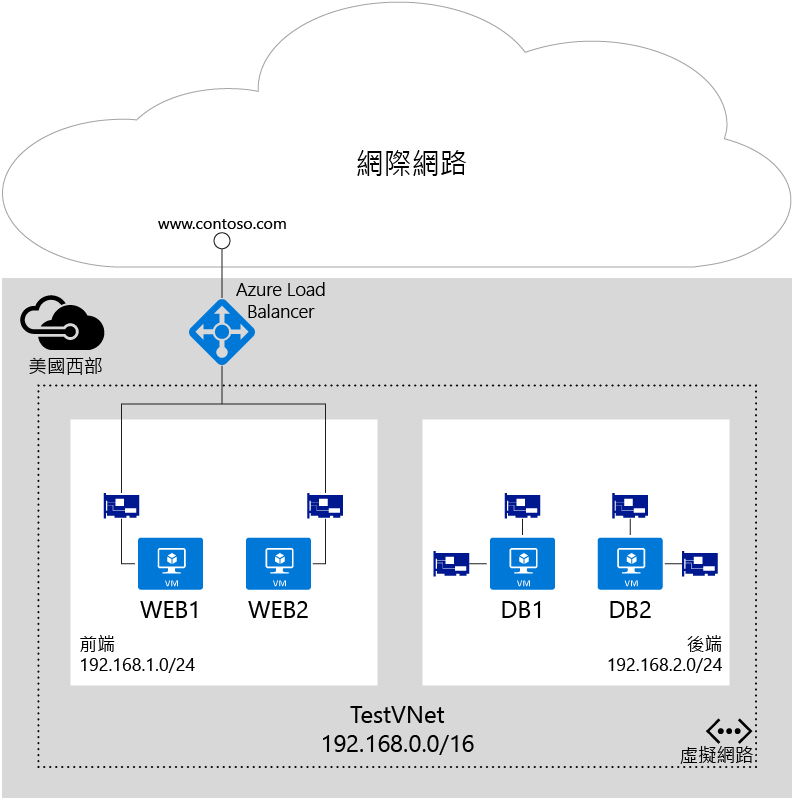

<properties 
   pageTitle="什麼是網路安全性群組 (NSG)"
   description="深入了解 Azure 中使用網路安全性群組 (NSG) 的分散式防火牆，以及如何使用 NSG 隔離及控制您的虛擬網路 (VNet) 中的流量流程。"
   services="virtual-network"
   documentationCenter="na"
   authors="jimdial"
   manager="carmonm"
   editor="tysonn" />
<tags 
   ms.service="virtual-network"
   ms.devlang="na"
   ms.topic="get-started-article"
   ms.tgt_pltfrm="na"
   ms.workload="infrastructure-services"
   ms.date="02/11/2016"
   ms.author="jdial" />

# 什麼是網路安全性群組 (NSG)？

網路安全性群組 (NSG) 包含存取控制清單 (ACL) 規則的清單，可允許或拒絕虛擬網路中 VM 執行個體的網路流量。NSG 可與子網路或該子網路內的個別 VM 執行個體相關聯。當 NSG 與子網路相關聯時，ACL 規則便會套用至該子網路中的所有 VM 執行個體。此外，將 NSG 直接關聯至該 VM 即可進一步限制個別 VM 的流量。

## NSG 資源

NSG 包含下列屬性。

|屬性|說明|條件約束|考量|
|---|---|---|---|
|名稱|NSG 的名稱|在區域內必須是唯一 可以包含字母、數字、底線、句號和連字號 必須以字母或數字開頭 必須以字母、數字或底線結尾 可以有最多 80 個字元|因為您可能需要建立數個 NSG，請確定您的命名慣例可讓您輕鬆識別 NSG 的功能|
|區域|NSG 裝載所在的 Azure 區域|NSG 只能套用到建立所在區域內的資源|請參閱以下的[限制](#Limits)以了解在區域中可以具備的 NSG 數量|
|資源群組|NSG 所屬的資源群組|雖然 NSG 屬於資源群組，它可以與任何資源群組中的資源相關聯，只要資源是與 NSG 相同的 Azure 區域的一部分|資源群組用來以部署單位的形式一起管理多個資源 您可以考慮將 NSG 其相關聯的資源群組在一起|
|規則|定義允許或拒絕流量的規則||請參閱下方的 [NSG 規則](#Nsg-rules)| 

>[AZURE.NOTE] 端點式 ACL 和網路安全性群組，不支援用於相同的 VM 執行個體。如果您想要使用 NSG 且已經擁有就地端點 ACL，請先移除端點 ACL。如需有關執行這項作業的資訊，請參閱＜[使用 PowerShell 管理端點的存取控制清單 (ACL)](virtual-networks-acl-powershell.md)＞。

### NSG 規則

NSG 規則包含下列屬性。

|屬性|說明|條件約束|考量|
|---|---|---|---|
|**名稱**|規則的名稱|在區域內必須是唯一 可以包含字母、數字、底線、句號和連字號 必須以字母或數字開頭 必須以字母、數字或底線結尾 可以有最多 80 個字元|在 NSG 內可以有數個規則，因此請確定您遵循可讓您識別規則的功能的命名慣例|
|**通訊協定**|規則要符合的通訊協定|TCP、UDP 或 *|使用 * 作為包括 ICMP (僅東西向流量) 以及 UDP 和 TCP 的通訊協定，而且可能會減少所需規則的數目 同時，使用 * 可能是過於廣泛的方法，因此請確定您只在真的必要時使用|
|**來源連接埠範圍**|規則要符合的來源連接埠範圍|1 到 65535 的單一連接埠號碼、連接埠範圍 (亦即 1-65635)，或 * (所有連接埠)|來源連接埠可以是暫時的。除非您的用戶端程式使用特定連接埠，否則請在大部分情況下使用 "*"。 請嘗試儘可能使用連接埠範圍以避免需要多個規則 多個連接埠或連接埠範圍不可使用逗號分組
|**目的地連接埠範圍**|規則要符合的目的地連接埠範圍|1 到 65535 的單一連接埠號碼、連接埠範圍 (亦即 1-65535)，或 * (所有連接埠)|請嘗試儘可能使用連接埠範圍以避免需要多個規則 多個連接埠或連接埠範圍不可使用逗號分組
|**來源位址首碼**|規則要符合的來源位址首碼或標籤|單一 IP 位址 (亦即 10.10.10.10)、IP 子網路 (亦即 192.168.1.0/24)、[預設標籤](#default-tags)或 * (用於所有位址)|考慮使用範圍、預設標籤和 * 以降低規則的數量|
|**Destination address prefix**|規則要符合的目的地位址首碼或標籤|單一 IP 位址 (亦即 10.10.10.10)、IP 子網路 (亦即 192.168.1.0/24)、[預設標籤](#default-tags)或 * (用於所有位址)|考慮使用範圍、預設標籤和 * 以降低規則的數量|
|**Direction**|規則要符合的流量方向|inbound (輸入) 或 outbound (輸出)|輸入和輸出規則會根據方向分別處理|
|**優先順序**|系統會依照規則優先順序檢查規則，一旦套用規則，就不會再測試規則是否符合|100 和 4096 之間的數字|考慮為每個規則建立 100 的跳躍優先順序，在現有的規則之間保留空間給新規則|
|**Access**|如果規則符合，要套用的存取類型|allow (允許) 或 deny (拒絕)|請注意，如果找不到封包的允許規則，則會捨棄封包|

NSG 包含兩組規則：輸入和輸出。規則的優先順序在每一個集合中必須是唯一的。

上圖顯示 NSG 規則的處理方式。

### 預設標籤

預設標籤是系統提供的識別項，用來解決 IP 位址的類別。您可以在任何規則的**來源位址首碼**和**目的地位址首碼**屬性使用預設標籤。有三個您可使用的預設標籤。

- **VIRTUAL\_NETWORK：**這個預設標籤代表所有網路位址空間。其包含虛擬網路位址空間 (在 Azure 中定義的 CIDR 範圍)，以及所有已連接的內部部署位址空間和已連接的 Azure VNet (區域網路)。

- **AZURE\_LOADBALANCER：**這個預設標籤代表 Azure 的基礎結構的負載平衡器。這會轉譯成作為 Azure 健康狀態探查來源的 Azure 資料中心 IP。

- **INTERNET：**這個預設標籤代表虛擬網路以外且可以透過公用網際網路進行存取的 IP 位址空間。此範圍也包括 [Azure 擁有的公用 IP 空間](https://www.microsoft.com/download/details.aspx?id=41653)。

### 預設規則

所有 NSG 都包含一組預設規則。預設規則無法刪除，但因為其會指派為最低優先權，因此可以由您所建立的規則覆寫預設規則。

如下方預設規則所示，虛擬網路中的流量起始和結束同時允許輸入和輸出方向。雖然輸出方向允許連接到網際網路，依預設會封鎖輸入方向。預設規則會允許 Azure 的負載平衡器探查 VM 和角色執行個體的健康狀態。如果您不使用負載平衡集合，則可以覆寫此規則。

**輸入預設規則**

| 名稱 | 優先順序 | 來源 IP | 來源連接埠 | 目的地 IP | 目的地連接埠 | 通訊協定 | 存取 |
|-----------------------------------|----------|--------------------|-------------|-----------------|------------------|----------|--------|
| 允許 VNet 輸入 | 65000 | VIRTUAL\_NETWORK | * | VIRTUAL\_NETWORK | * | * | 允許 |
| 允許 Azure 負載平衡器輸入 | 65001 | AZURE\_LOADBALANCER | * | * | * | * | 允許 |
| 拒絕所有輸入 | 65500 | * | * | * | * | * | 拒絕 |

**輸出預設規則**

| 名稱 | 優先順序 | 來源 IP | 來源連接埠 | 目的地 IP | 目的地連接埠 | 通訊協定 | 存取 |
|-------------------------|----------|-----------------|-------------|-----------------|------------------|----------|--------|
| 允許 VNet 輸出 | 65000 | VIRTUAL\_NETWORK | * | VIRTUAL\_NETWORK | * | * | 允許 |
| 允許網際網路輸出 | 65001 | * | * | 網際網路 | * | * | 允許 |
| 拒絕所有輸出 | 65500 | * | * | * | * | * | 拒絕 |

## 建立 NSG 關聯

視您使用的部署模型而定，您可以將 NSG 與 VM、NIC 和子網路建立關聯。

[AZURE.INCLUDE [learn-about-deployment-models-both-include.md](../../includes/learn-about-deployment-models-both-include.md)]
 
- **將 NSG 與 VM 建立關聯 (僅傳統部署)。** 當您將 NSG 與 VM 建立關聯時，NSG 中的網路存取規則會套用到預定要進入和離開 VM 的所有流量。

- **將 NSG 與 NIC 建立關聯 (僅資源管理員部署)。** 當您將 NSG 與 NIC 建立關聯時，NSG 中的網路存取規則只會套用到該 NIC。這表示多 NIC 的 VM 中，如果 NSG 已套用到單一 NIC，則它不會影響繫結至其他 NIC 的流量。

- **將 NSG 與子網路建立關聯 (所有部署)**。當您將 NSG 與子網路建立關聯時，NSG 中的網路存取規則會套用到子網路中的所有 IaaS 和 PaaS 資源。

您可以將不同 NSG 與 VM (或 NIC，根據部署模型而定) 和 NIC 或 VM 繫結的子網路建立關聯。當發生這種情況時，所有網路存取規則都會依每個 NSG 中的優先順序，以下列順序套用到流量：

- **輸入流量**
	1. NSG 已套用到子網路。
	
           如果子網路 NSG 有拒絕流量的相符規則，封包會在此遭到捨棄。
	2. NSG 已套用至 NIC (資源管理員) 或 VM (傳統)。
	   
           如果 VM\\NIC NSG 有拒絕流量的相符規則，封包會在 VM\\NIC 遭到捨棄，雖然子網路 NSG 有允許流量的相符規則。
- **輸出流量**
	1. NSG 已套用至 NIC (資源管理員) 或 VM (傳統)。
	  
           如果 VM\\NIC NSG 有拒絕流量的相符規則，封包會在此遭到捨棄。
	2. NSG 已套用到子網路。
	   
           如果子網路 NSG 有拒絕流量的相符規則，封包會在此遭到捨棄，雖然 VM\\NIC NSG 有允許流量的相符規則。

	

>[AZURE.NOTE] 雖然您只能將單一 NSG 與子網路、VM 或 NIC 建立關聯，但您可以盡量將同一個 NSG 與許多您想要的資源建立關聯。

## 實作
您可以使用以下列出的不同工具，在傳統或資源管理員部署模型中實作 NSG。

|部署工具|傳統|資源管理員|
|---|---|---|
|傳統入口網站|||
|Azure 入口網站||[![是][green]](virtual-networks-create-nsg-arm-pportal.md)|
|PowerShell|[![是][green]](virtual-networks-create-nsg-classic-ps.md)|[![是][green]](virtual-networks-create-nsg-arm-ps.md)|
|Azure CLI|[![是][green]](virtual-networks-create-nsg-classic-cli.md)|[![是][green]](virtual-networks-create-nsg-arm-cli.md)|
|ARM 範本||[![是][green]](virtual-networks-create-nsg-arm-template.md)|

|**Key**| 支援。| 不支援。|
|---|---|---|

## 規劃

實作 NSG 之前，您需要回答下列問題：

1. 您要篩選前往或來自何種類型資源的流量 (在相同的 VM 中的 NIC、VM 或其他資源例如連接到相同子網路的雲端服務或應用程式服務環境，或連線到不同子網路的資源)？

2. 您想要篩選的資源流量是往返於連接到現有的 VNet 中的子網路，或將它們會連接到新的子網路或 VNet？
 
如需 Azure 中的網路安全性規劃的詳細資訊，請閱讀[雲端服務和網路安全性的最佳作法](../best-practices-network-security.md)。

## 設計考量

一旦您知道[規劃](#Planning)小節中問題的答案，在定義您的 NSG 之前，請檢閱下列項目。

### 限制

您需要在設計 NSG 時考量下列限制。

|**說明**|**預設限制**|**含意**|
|---|---|---|
|您可以與子網路、VM 或 NIC 建立關聯的 NSG 數目|1|這表示您無法結合 NSG。請確定指定資源集合所需的所有規則都包含在單一 NSG 中。|
|每個訂用帳戶每個區域的 NSG 數目|100|根據預設，會為新您在 Azure 入口網站中建立的每個 VM 建立新 NSG。如果您允許此預設行為，將會快速用完 NSG。在設計期間請確定您記住這項限制，並在必要時將資源分隔成多個區域或訂用帳戶。 |
|每一 NSG 的 NSG 規則|200|使用大範圍的 IP 和連接埠可確保您不會超過這項限制。 |

>[AZURE.IMPORTANT] 請確定您在設計方案之前，已檢視所有[在 Azure 中與網路服務相關的限制](../azure-subscription-service-limits.md#networking-limits)。您可以開啟支援票證來提高部分限制。

### VNet 和子網路的設計

由於 NSG 可以套用至子網路，依子網路群組您的資源並將 NSG 套用至子網路，即可減少 NSG 的數量。如果您決定將 NSG 套用至子網路，可能會發現您擁有的現有 VNet 與子網路未使用 記憶中的 NSG 定義。您可能需要定義新 VNet 和子網路以支援 NSG 設計。並將您的新資源部署到新子網路。然後您就可以定義移轉策略，將現有的資源移至新的子網路。

### 特殊規則

您必須將下面所列的特殊規則列入考量。請確定您不會封鎖這些規則允許的流量，否則您的基礎結構將無法與基本的 Azure 服務進行通訊。

- **節點的虛擬 IP：**基本的基礎結構服務，例如 DHCP、DNS 和健康狀態監控是透過虛擬化主機 IP 位址 168.63.129.16 所提供。這個公用 IP 位址屬於 Microsoft，且是針對此目的唯一用於所有區域的虛擬 IP。此 IP 位址對應至伺服器電腦的實體 IP 位址 (主機節點)，該伺服器用來主控虛擬機器。主機節點的作用如同 DHCP 轉送、DNS 遞迴解析程式，以及負載平衡器健康狀態探查和電腦健康狀態探查的探查來源。此 IP 位址的通訊不應視為一種攻擊。

- **授權 (金鑰管理服務)：**應該授權在虛擬機器中執行的 Windows 映像。若要這樣做，授權要求會傳送至處理此類查詢的金鑰管理服務主機伺服器。這會一律位於輸出連接埠 1688。

### ICMP 流量

目前的 NSG 規則僅可用於通訊協定 *TCP* 或 *UDP*。*ICMP* 沒有特定的標記。不過，系統依預設會透過輸入 VNet 規則 (預設規則 65000 輸入) 來允許虛擬網路內的 ICMP 流量，該規則會允許 VNet 內任何連接埠的輸入/輸出流量以及通訊協定。

### 子網路

- 請考慮您的工作負載所需要的階層數目。每個層級可以使用子網路與套用至子網路的 NSG 來隔離。
- 如果您需要為 VPN 閘道或 ExpressRoute 電路實作子網路，請確定您**不**對該子網路套用 NSG。如果您這麼做，您的跨 VNet 或跨內部部署連線將無法運作。
- 如果您需要實作虛擬應用裝置，請確定您在其自己的子網路上部署虛擬應用裝置，使得使用者定義的路由 (UDR) 可以正確運作。您可以實作子網路層級 NSG，以篩選流入和流出此子網路的流量。深入了解[如何控制流量和使用虛擬應用裝置](virtual-networks-udr-overview.md)。

### 負載平衡器

- 請考慮每個工作負載所使用的每個負載平衡器的負載平衡和 NAT 規則。這些規則會繫結至包含 NIC (資源管理員部署) 或 VM/角色執行個體 (傳統部署) 的後端集區。請考慮為每個後端集區建立 NSG，僅允許透過負載平衡器中實作的規則對應的流量。如此可保證直接進入後端集區，而不會經過負載平衡器傳遞的流量也會受到篩選。
- 在傳統部署中，您會建立端點，該端點可將負載平衡器上的連接埠對應至您的 VM 或角色執行個體上的連接埠。您也可以在資源管理員部署中建立您自己個別對外公開的負載平衡器。如果是使用 NSG 來限制對 VM 和屬於負載平衡器中後端集區的角色執行個體的流量，請記得，連入流量的目的地連接埠是 VM 或角色執行個體中的實際通訊埠，而不是負載平衡器公開的連接埠。也請記住，連接至 VM 的來源連接埠和位址是在網際網路中遠端電腦上的連接埠和位址，而不是負載平衡器所公開的連接埠和位址。
- 與公開的負載平衡器類似，當您建立 NSG 來篩選透過內部負載平衡器 (ILB) 的流量時，您必須了解套用的來源連接埠和位址範圍是來自原始呼叫的電腦，而不是負載平衡器。而目的地連接埠和位址範圍是與接收流量的電腦相關，而不是負載平衡器。

### 其他

- 不支援將端點式 ACL 和 NSG 用於相同的 VM 執行個體。如果您想要使用 NSG 且已經擁有就地端點 ACL，請先移除端點 ACL。如需如何執行這項操作的詳細資訊，請參閱[管理端點 ACL](virtual-networks-acl-powershell.md)。
- 在資源管理員部署模型中，您可以對具有多個 NIC 的 VM 使用與 NIC 相關聯的 NSG，以啟用透過 NIC 的管理 (遠端存取)，因此分離流量。
- 與使用負載平衡器類似，篩選來自其他 VNet 的流量時，您必須使用遠端電腦的來源位址範圍，而不是連接 VNet 的閘道。
- 許多 Azure 服務無法連接到 Azure 虛擬網路，因此無法使用 NSG 篩選往返它們的流量。閱讀您所使用的服務文件，以判斷它們是否可以連線到 VNet。

## 部署範例

為了說明這篇文章中資訊的應用，我們會定義 NSG 來篩選具有下列需求的兩層工作負載方案的網路流量：

1. 分離前端 (Windows Web 伺服器) 和後端 (SQL 資料庫伺服器) 之間的流量。
2. 負載平衡規則會將到負載平衡器的流量轉送至所有 Web 伺服器的連接埠 80。
3. NAT 規則會將負載平衡器上連接埠 50001 進入的流量轉送至前端中唯一的一個 VM 的連接埠 3389。
4. 無法從網際網路存取前端或後端 VM，但要求編號 1 例外。
5. 從前端或後端無法存取網際網路。
6. 讓來自前端子網路本身的流量存取連接埠 3389 到前端中的任何 Web 伺服器。
7. 僅從前端子網路存取連接埠 3389 到後端中的所有 SQL Server VM。
8. 僅從前端子網路存取連接埠 1433 到後端中的所有 SQL Server VM。
9. 區隔後端 VM 中不同 NIC 上的管理流量 (連接埠 3389) 和資料庫流量 (1433)。

在以上圖表中可以看到，*Web1* 和 *Web2* VM 連接到 *FrontEnd* 子網路，而 *DB1* 和 *DB2* VM 連接到 *BackEnd* 子網路。這兩個子網路屬於 *TestVNet* VNet。所有的資源指派給*美國西部* Azure 區域。

上述的需求 1-6 (3 例外) 均限制在子網路空間。若要將每個 NSG 所需的規則數目降至最低，並讓您輕鬆加入其他 VM 至與現有 VM 執行相同工作負載類型的子網路，我們可以實作下列子網路層級的 NSG。

### 用於前端子網路的 NSG

**連入規則**

|規則|Access|優先順序|來源位址範圍|來源連接埠|目的地連接埠範圍|目的地連接埠|通訊協定|
|---|---|---|---|---|---|---|---|
|允許 HTTP|允許|100|網際網路|*|*|80|TCP|
|允許 RDP 來自前端|允許|200|192\.168.1.0/24|*|*|3389|TCP|
|拒絕來自網際網路的任何項目|拒絕|300|網際網路|*|*|*|TCP|

**連出規則**

|規則|Access|優先順序|來源位址範圍|來源連接埠|目的地連接埠範圍|目的地連接埠|通訊協定|
|---|---|---|---|---|---|---|---|
|拒絕網際網路|拒絕|100|*|*|網際網路|*|*|

### 用於後端子網路的 NSG

**連入規則**

|規則|Access|優先順序|來源位址範圍|來源連接埠|目的地連接埠範圍|目的地連接埠|通訊協定|
|---|---|---|---|---|---|---|---|
|拒絕網際網路|拒絕|100|網際網路|*|*|*|*|

**連出規則**

|規則|Access|優先順序|來源位址範圍|來源連接埠|目的地連接埠範圍|目的地連接埠|通訊協定|
|---|---|---|---|---|---|---|---|
|拒絕網際網路|拒絕|100|*|*|網際網路|*|*|

### 用於來自網際網路 RDP 的前端中單一 VM (NIC) 的 NSG

**連入規則**

|規則|Access|優先順序|來源位址範圍|來源連接埠|目的地連接埠範圍|目的地連接埠|通訊協定|
|---|---|---|---|---|---|---|---|
|允許 RDP 來自網際網路|允許|100|網際網路|*|*|3389|TCP|

>[AZURE.NOTE] 注意這項規則的來源位址範圍為何是**網際網路**，而不是負載平衡器的 VIP；來源連接埠是 *****，而不是 500001。不要在 NAT 規則/負載平衡規則和 NSG 規則之間感到混淆。NSG 規則永遠與流量的原始來源和最終目的地的相關，而**不是**兩者之間的負載平衡器。

### 用於後端管理 NIC 的 NSG

**連入規則**

|規則|Access|優先順序|來源位址範圍|來源連接埠|目的地連接埠範圍|目的地連接埠|通訊協定|
|---|---|---|---|---|---|---|---|
|允許 RDP 來自前端|允許|100|192\.168.1.0/24|*|*|3389|TCP|

### 用於後端資料庫存取 NIC 的 NSG

**連入規則**

|規則|Access|優先順序|來源位址範圍|來源連接埠|目的地連接埠範圍|目的地連接埠|通訊協定|
|---|---|---|---|---|---|---|---|
|允許 SQL 來自前端|允許|100|192\.168.1.0/24|*|*|1433|TCP|

由於上述的部分 NSG 必須與個別的 NIC 關聯，您必須將此案例部署為資源管理員部署。請注意子網路和 NIC 層級的規則如何結合，視其套用的方式而定。

## 後續步驟

- [在傳統部署模型中部署 NSG](virtual-networks-create-nsg-classic-ps.md)。
- [在資源管理員中部署 NSG](virtual-networks-create-nsg-arm-pportal.md)。
- [管理 NSG 記錄檔](virtual-network-nsg-manage-log.md)。

[green]: ./media/virtual-network-nsg-overview/green.png
[yellow]: ./media/virtual-network-nsg-overview/yellow.png
[red]: ./media/virtual-network-nsg-overview/red.png

<!---HONumber=AcomDC_0907_2016--->